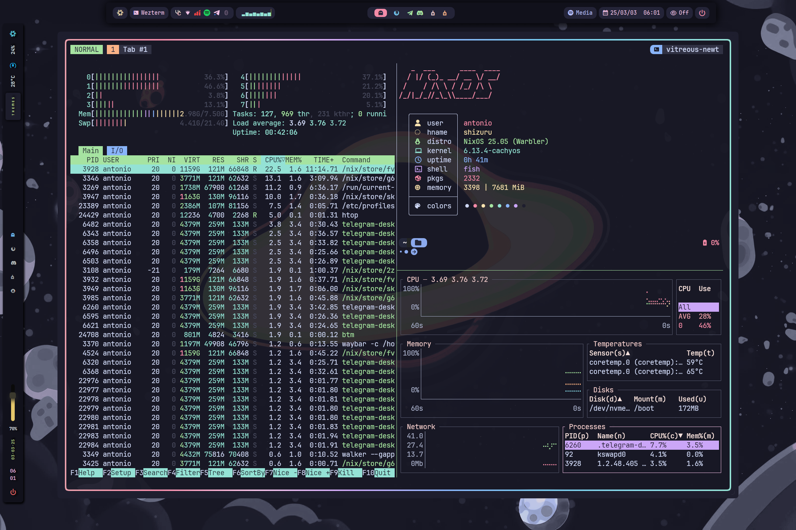
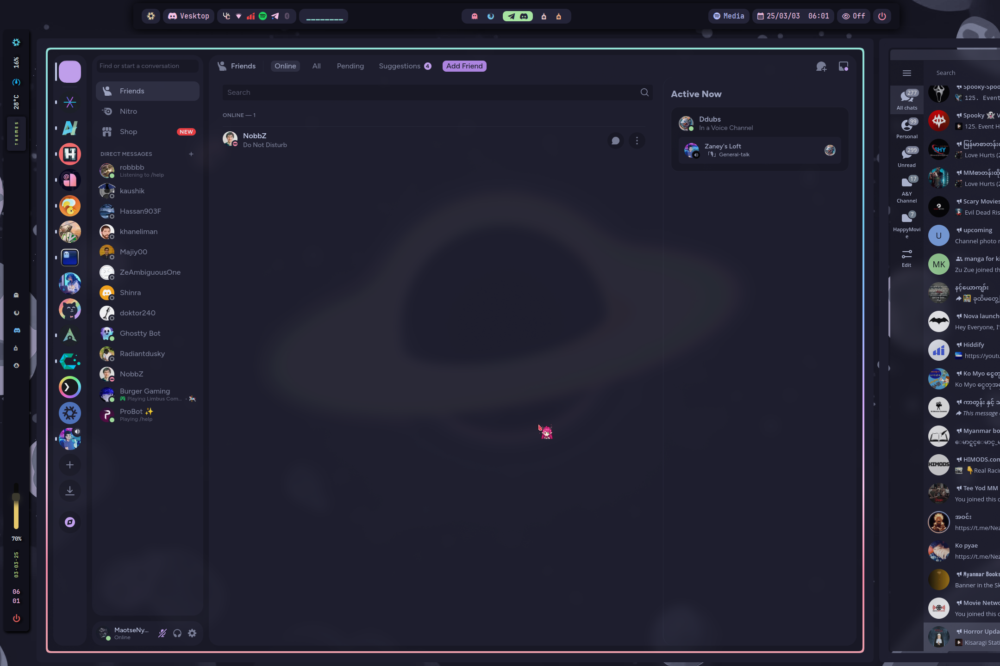
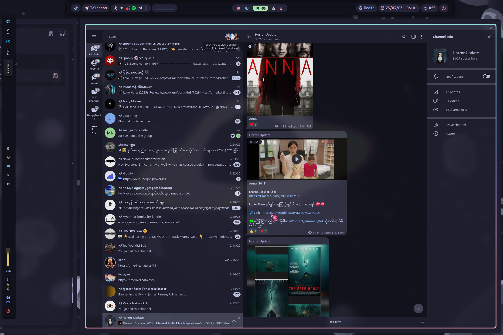

<h1 align="center">
    
   <br>
      Nixy4Life  
   <br>
       <br>

   <div align="center">
      <p></p>
      <div align="center">
         <a href="https://github.com/Frost-Phoenix/nixos-config/stargazers">
            
         </a>
         <a href="https://github.com/maotseantonio/NixOS-Hyprland/">
            
         </a>
         <a = href="https://nixos.org">
            
         </a>
         <a>
            
         </a>
      </div>
      <br>
   </div>
</h1>


### 🖼️ Gallery

<p align="center">
    <br>
    <br>
    <br>
    <br>
   Screenshots last updated <b>2024-12-05</b>
</p>


# 🗃️ Overview

## 📚 Layout

-   [flake.nix](flake.nix) base of the configuration
-   [hosts](hosts) 🌳 per-host configurations that contain machine specific configurations
    - [default](hosts/default/) 🖥️Default configuration for install script
    - [nixy4life](hosts/nixy4life/) 💻 Laptop specific configuration for my like
        - [config](hosts/nixy4life/config.nix) kernel packages(cachyos kernel), scx enable(scx_lavd) and system level packages
        - [hardware](hosts/nixy4life/hardware.nix) hardware configuration
        - [user](hosts/nixy4life/user.nix) user specific packages(shell)
        - [variables](hosts/nixy4life/variables.nix) user variables git username email
-   [modules](modules) 🍱 for more modularize
    - [bootloader](modules/bootloader.nix) kernel packages(cachyos kernel) grub2 plymouth theme(catppuccin)
    - [flatpak](modules/flatpak.nix) declarative flatpak
    - [fonts](modules/fonts.nix) fonts packages
    - [hardwareconf](modules/hardwareconf.nix) hardware configuration
    - [intel-driver](modules/intel-driver.nix) intel graphic intel-driver
    - [nvidia-driver](modules/nvidia-driver) nvidia graphic driver
    - [local-hardware-clock](modules/local-hardware-clock.nix)hardware clock(i dontknow this will be needed)
    - [network](modules/network.nix) network configuration 
    - [nvidia-prime](modules/nvidia-prime-driver) nvidia prime configuration
    - [nvidia-patch](modules/nvidia-patch) nvidia patch for linux 6.12 kernel
    - [services](modules/services.nix) services for nix system
    - [system](modules/system.nix) system specific packages and settings
    - [virtualization](modules/virtualization.nix) virtualization specific packages
    - [wayland](modules/wayland.nix) wayland specific packages


## 📓 Components
|                             | NixOS + Hyprland                                                                              |
| --------------------------- | :---------------------------------------------------------------------------------------------:
| **Window Manager**          | [Hyprland] |
| **Bar**                     | HyprPanel |
| **Application Launcher**    | [rofi] |
| **Notification Daemon**     | ags|
| **Terminal Emulator**       | Wezterm + kitty |
| **Shell**                   | fish + atuin + [Starship] |
| **Text Editor**             | [VSCodium] + nix4nvchad |
| **network management tool** | [NetworkManager] + [network-manager-applet] |
| **System resource monitor** | Btop + Bottom |
| **File Manager**            | thunar + [yazi] |
| **Fonts**                   | LigaMono Nerd Font + JetBrainsMono Nerd Font|
| **Color Scheme**            | Catppuccin-Mocha + Catppuccin-Dark |
| **Cursor**                  | Chiharu |
| **Icons**                   | [Papirus-Dark] |
| **Lockscreen**              | [Hyprlock] |
| **Image Viewer**            |  imv |
| **Media Player**            | [mpv] |
| **Music Player**            | spotify |
| **Screenshot Software**     | [grimblast] |
| **Screen Recording**        | [wf-recorder] |
| **Clipboard**               | [wl-clip-persist] |
| **Color Picker**            | [hyprpicker] |


## 📝 Shell aliases

<details>
<summary>
Utils (EXPAND)
</summary>

- ```cl```     $\rightarrow$ ```clear```
- ```cd```    $\rightarrow$ ```z```
- ```tt```    $\rightarrow$ ```gtrash put```
- ```v```   $\rightarrow$ ```nvim```
- ```cat```   $\rightarrow$ ```bat```
- ```code```  $\rightarrow$ ```codium```
- ```icat```  $\rightarrow$ ```kitten icat```
- ```l```     $\rightarrow$ ```eza --icons  -a --group-directories-first -1```
- ```ll```    $\rightarrow$ ```eza --icons  -a --group-directories-first -1 --no-user --long```
- ```tree```  $\rightarrow$ ```eza --icons --tree --group-directories-first```
</details>

<details>
<summary>
Nixos (EXPAND)
</summary>

- ```cdnix```      $\rightarrow$ ```cd ~/NixOS-Hyprland/ && codium ~/NixOS-Hyprland/```
- ```nix-rebuild```   $\rightarrow$ ```sudo nixos rebuild switch --flake .#nixy4life```
</details>

<details>
<summary>
Git (EXPAND)
</summary>

- ```g```     $\rightarrow$ ```lazygit```
- ```gf```    $\rightarrow$ ```onefetch --number-of-file-churns 0 --no-color-palette```
- ```ga```    $\rightarrow$ ```git add```
- ```gaa```   $\rightarrow$ ```git add --all```
- ```gs```    $\rightarrow$ ```git status```
- ```gb```    $\rightarrow$ ```git branch```
- ```gm```    $\rightarrow$ ```git merge```
- ```gd```    $\rightarrow$ ```git diff```
- ```gpl```   $\rightarrow$ ```git pull```
- ```gplo```  $\rightarrow$ ```git pull origin```
- ```gps```   $\rightarrow$ ```git push```
- ```gpso```  $\rightarrow$ ```git push origin```
- ```gpst```  $\rightarrow$ ```git push --follow-tags```
- ```gcl```   $\rightarrow$ ```git clone```
- ```gc```    $\rightarrow$ ```git commit```
- ```gcm```   $\rightarrow$ ```git commit -m```
- ```gcma```  $\rightarrow$ ```git add --all && git commit -m```
- ```gtag```  $\rightarrow$ ```git tag -ma```
- ```gch```   $\rightarrow$ ```git checkout```
- ```gchb```  $\rightarrow$ ```git checkout -b```
- ```glog```  $\rightarrow$ ```git log --oneline --decorate --graph```
- ```glol```  $\rightarrow$ ```git log --graph --pretty='%Cred%h%Creset -%C(auto)%d%Creset %s %Cgreen(%ar) %C(bold blue)<%an>%Creset'```
- ```glola``` $\rightarrow$ ```git log --graph --pretty='%Cred%h%Creset -%C(auto)%d%Creset %s %Cgreen(%ar) %C(bold blue)<%an>%Creset' --all```
- ```glols``` $\rightarrow$ ```git log --graph --pretty='%Cred%h%Creset -%C(auto)%d%Creset %s %Cgreen(%ar) %C(bold blue)<%an>%Creset' --stat```
  
</details>

## 🛠️ Scripts

All the scripts are in ```~/.config/home-manager/scripts/scripts/``` and are exported as packages in ```~/.config/home-manager/scripts/scripts.nix```

<details>
<summary>
extract.sh 
</summary>

**Description:** This script extract ```tar.gz``` archives in the current directory.

**Usage:** ```extract <archive_file>```
</details>

<details>
<summary>
compress.sh 
</summary>

**Description:** This script compress a file or a folder into a ```tar.gz``` archives which is created in the current directory with the name of the chosen file or folder. 

**Usage:** ```compress <file>``` or ```compress <folder>```
</details>

<details>
<summary>
toggle_blur.sh 
</summary>

**Description:** This script toggles the Hyprland blur effect. If the blur is currently enabled, it will be disabled, and if it's disabled, it will be turned on. 

**Usage:** ```toggle_blur```
</details>

<details>
<summary>
toggle_oppacity.sh 
</summary>

**Description:** This script toggles the Hyperland oppacity effect. If the oppacity is currently set to 0.90, it will be set to 1, and if it's set to 1, it will be set to 0.90. 

**Usage:** ```toggle_oppacity```
</details>

<details>
<summary>
maxfetch.sh 
</summary>

**Description:** This script is a modified version of the [jobcmax/maxfetch][maxfetch] script.

**Usage:** ```maxfetch```
</details>

<details>
<summary>
music.sh 
</summary>

**Description:** This script is for managing Audacious (music player). If Audacious is currently running, it will be killed (stopping the music); otherwise, it will start Audacious in the 8th workspace and resume the music. 

**Usage:** ```music```
</details>

<details>
<summary>
runbg.sh 
</summary>

**Description:** This script runs a provided command along with its arguments and detaches it from the terminal. Handy for launching apps from the command line without blocking it. 

**Usage:** ```runbg <command> <arg1> <arg2> <...>```
</details>


```bash
nix-shell -p git
git clone https://github.com/maotseantonio/NixOS-Hyprland
cd NixOS-Hyprland
```
#### 3. **Install script**
> [!CAUTION]
> For some computers, the default rebuild command might get stuck due to CPU cores running out of RAM. To fix that modify the install script line: ```sudo nixos-rebuild switch --flake .#${HOST}``` to ```sudo nixos-rebuild switch --cores <less than your max number of cores> --flake .#${HOST}```

> [!TIP]
> As it is better to know what a script does before running it, you are advised to read it or at least see the [Install script walkthrough](#Install-script-walkthrough) section before execution.
   
Execute and follow the installation script :
```bash
./install.sh
```
  
#### 4. **Reboot**

After rebooting, the config should be applied, you'll be greeted by hyprlock prompting for your password.

#### 5. **Manual config**

```

## Install script walkthrough

A brief walkthrough of what the install script does.

#### 1. **Get username**

You will receive a prompt to enter your username, with a confirmation check.

#### 2. **Set username**

The script will replace all occurancies of the default usename ```CURRENT_USERNAME``` by the given one stored in ```$username```

#### 3. Create basic directories

The following directories will be created:
- ```~/Music```
- ```~/Documents```
- ```~/Pictures/wallpapers/others```

#### 4. Copy the wallpapers

Then the wallpapers will be copied into ```~/Pictures/wallpapers/others``` which is the folder in which the ```wallpaper-picker.sh``` script will be looking for them.

#### 5. Get the hardware configuration

It will also automatically copy the hardware configuration from ```/etc/nixos/hardware-configuration.nix``` to ```./hosts/${host}/hardware-configuration.nix``` so that the hardware configuration used is yours and not the default one.

#### 6. Choose a host (desktop / laptop)

Now you will need to choose the host you want. It depend on whether you are using a desktop or laptop (or a VM altho it can be realy buggy).

#### 7. Build the system

Lastly, it will build the system, which includes both the flake config and home-manager config.
```
# 👥 Credits

Other dotfiles that I learned / copy from:

- I really thanksful for frost-phoenix making this template and i credits to this man
 - [https://github.com/Frost-Phoenix/nixos-config/tree/catppuccin?tab=readme-ov-file]
- Nix Flakes
  - [nomadics9/NixOS-Flake](https://github.com/nomadics9/NixOS-Flake): This is where I start my nixos / hyprland journey.
  - [samiulbasirfahim/Flakes](https://github.com/samiulbasirfahim/Flakes): General flake / files structure
  - [justinlime/dotfiles](https://github.com/justinlime/dotfiles): Mainly waybar (old design)
  - [skiletro/nixfiles](https://github.com/skiletro/nixfiles): Vscodium config (that prevent it to crash)
  - [fufexan/dotfiles](https://github.com/fufexan/dotfiles)
  - [tluijken/.dotfiles](https://github.com/tluijken/.dotfiles): base rofi config
  - [mrh/dotfiles](https://codeberg.org/mrh/dotfiles): base waybar config
  - [JaKooLit/NixOS-Hyprland](https://github.com/JaKooLit/NixOS-Hyprland): my base config
  - [orangc/dots](https://github.com/orangci/dots.git): shout out to this man. He helps me in my begining of nixos jorney. If i didnt get help from this people i will leave this beautiful world.

- README
  - [ryan4yin/nix-config](https://github.com/ryan4yin/nix-config)
  - [NotAShelf/nyx](https://github.com/NotAShelf/nyx)
  - [sioodmy/dotfiles](https://github.com/sioodmy/dotfiles)
  - [Ruixi-rebirth/flakes](https://github.com/Ruixi-rebirth/flakes)


<!-- # ✨ Stars History -->

<!-- <p align="center"></p> -->

<p align="center"></p>

<!-- end of page, send back to the top -->

<div align="right">
  <a href="#readme">Back to the Top</a>
</div>

<!-- Links -->
[Hyprland]: https://github.com/hyprwm/Hyprland
[Wezterm]: https://wezfurlong.org/wezterm/index.html
[Starship]: https://github.com/starship/starship
[Waybar]: https://github.com/Alexays/Waybar
[rofi]: https://github.com/lbonn/rofi
[Btop]: https://github.com/aristocratos/btop
[nemo]: https://github.com/linuxmint/nemo/
[yazi]: https://github.com/sxyazi/yazi
[zsh]: https://ohmyz.sh/
[oh-my-zsh]: https://ohmyz.sh/
[Swaylock-effects]: https://github.com/mortie/swaylock-effects
[Hyprlock]: https://github.com/hyprwm/hyprlock
[audacious]: https://audacious-media-player.org/
[mpv]: https://github.com/mpv-player/mpv
[VSCodium]:https://vscodium.com/
[Neovim]: https://github.com/neovim/neovim
[grimblast]: https://github.com/hyprwm/contrib
[qview]: https://interversehq.com/qview/
[swaync]: https://github.com/ErikReider/SwayNotificationCenter
[Nerd fonts]: https://github.com/ryanoasis/nerd-fonts
[NetworkManager]: https://wiki.gnome.org/Projects/NetworkManager
[network-manager-applet]: https://gitlab.gnome.org/GNOME/network-manager-applet/
[wl-clip-persist]: https://github.com/Linus789/wl-clip-persist
[wf-recorder]: https://github.com/ammen99/wf-recorder
[hyprpicker]: https://github.com/hyprwm/hyprpicker
[Gruvbox]: https://github.com/morhetz/gruvbox
[Papirus-Dark]: https://github.com/PapirusDevelopmentTeam/papirus-icon-theme
[Bibata-Modern-Ice]: https://www.gnome-look.org/p/1197198
[maxfetch]: https://github.com/jobcmax/maxfetch
